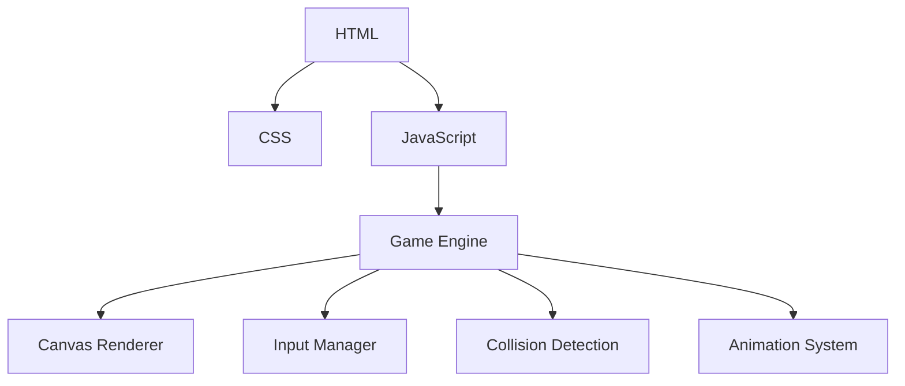

## 1. Architecture Design
纯前端单页面应用，使用 HTML5 Canvas 渲染游戏画面



## 2. Technology Description
- 前端：纯 HTML5 + CSS3 + Vanilla JavaScript
- 渲染：HTML5 Canvas 2D API
- 无需后端服务
- 无需数据库

## 3. File Structure
| File | Purpose |
|------|---------|
| index.html | 游戏主页面，包含 DOM 结构和 Canvas |
| styles.css | 样式文件，包含像素风格设计 |
| game.js | 游戏核心逻辑 |

## 4. Core Classes & Functions

### 4.1 Mech Class
```javascript
class Mech {
  constructor(x, y, color, controls) {
    this.x = x;
    this.y = y;
    this.color = color;
    this.health = 100;
    this.maxHealth = 100;
    this.state = 'idle'; // idle, moving, attacking, defending, hit
    this.direction = 1; // 1 right, -1 left
    this.speed = 3;
    this.controls = controls;
    this.attackCooldown = 0;
    this.defenseActive = false;
  }

  update(keys) { /* 处理输入和状态更新 */ }
  draw(ctx) { /* 绘制机甲 */ }
  takeDamage(damage) { /* 处理受伤逻辑 */ }
  attack() { /* 处理攻击逻辑 */ }
}
```

### 4.2 Game Class
```javascript
class Game {
  constructor(canvas) {
    this.canvas = canvas;
    this.ctx = canvas.getContext('2d');
    this.mech1 = new Mech(100, 250, '#0f3460', {
      left: 'a', right: 'd', up: 'w', down: 's', attack: 'j', defend: 'k'
    });
    this.mech2 = new Mech(450, 250, '#e94560', {
      left: 'ArrowLeft', right: 'ArrowRight', up: 'ArrowUp', down: 'ArrowDown', attack: '1', defend: '2'
    });
    this.keys = {};
    this.gameOver = false;
    this.winner = null;
  }

  start() { /* 启动游戏循环 */ }
  update() { /* 更新游戏状态 */ }
  draw() { /* 渲染游戏画面 */ }
  checkCollisions() { /* 碰撞检测 */ }
  checkGameOver() { /* 检查游戏结束条件 */ }
}
```

## 5. Key Game Mechanics
- **移动系统**：每个机甲可以左右移动，上下跳跃/下蹲
- **攻击系统**：按键触发攻击，有冷却时间，造成伤害
- **防御系统**：按键触发防御，减少或完全阻挡伤害
- **血量系统**：每个机甲 100 点血量，降到 0 游戏结束
- **胜负判定**：一方血量为 0 时，另一方获胜

## 6. Pixel Art Rendering
- 使用 Canvas 绘制像素风格的机甲
- 每个机甲由像素块组成，包含身体、头部、手臂、腿部
- 实现简单的帧动画系统
- 添加 CRT 扫描线效果增强复古感

## 7. Input Handling
- 使用 keydown 和 keyup 事件监听键盘输入
- 维护按键状态对象
- 支持同时按下多个按键
