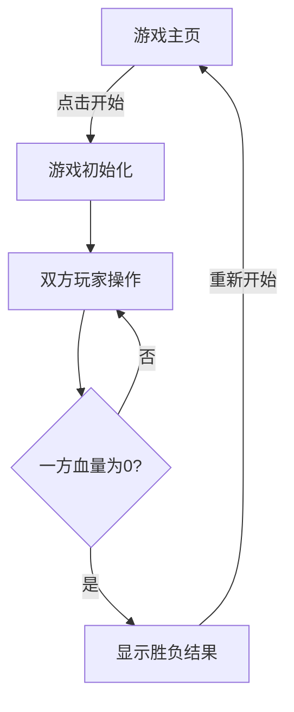

## 1. Product Overview
像素风机甲对战小游戏 - 一款双人对战的复古像素风格游戏
- 主要目的：提供简单有趣的机甲对战体验，支持两名玩家在同一设备上操作
- 目标用户：游戏爱好者，喜欢像素风格和简单操作的玩家

## 2. Core Features

### 2.1 User Roles
| Role | Registration Method | Core Permissions |
|------|---------------------|------------------|
| Player 1 | No registration | Use A/D/W/S keys to move, J to attack, K to defend |
| Player 2 | No registration | Use left/right/up/down arrow keys to move, 1 to attack, 2 to defend |

### 2.2 Feature Module
1. **游戏主页**：标题展示、游戏说明、开始按钮
2. **游戏对战页面**：游戏画布、血量条、操作提示、胜负判定

### 2.3 Page Details
| Page Name | Module Name | Feature description |
|-----------|-------------|---------------------|
| 游戏主页 | Hero section | 展示像素风格标题、游戏规则说明、开始游戏按钮 |
| 游戏对战页面 | 游戏画布 | 渲染机甲角色、背景场景、攻击/防御动画 |
| 游戏对战页面 | 状态面板 | 显示双方血量条、角色名称、当前状态 |
| 游戏对战页面 | 操作提示 | 实时显示双方可使用的操作按键 |
| 游戏对战页面 | 胜负判定 | 游戏结束时显示获胜方，并提供重新开始选项 |

## 3. Core Process
游戏开始 → 双方玩家操作各自机甲进行对战 → 一方血量降为0 → 判定胜负 → 显示结果 → 重新开始

## 4. User Interface Design
### 4.1 Design Style
- 主色调：深灰色背景 (#1a1a2e)，蓝色机甲 (#0f3460)，红色机甲 (#e94560)
- 按钮风格：像素化边框，悬停时有发光效果
- 字体：Press Start 2P（复古像素字体）
- 布局风格：居中布局，游戏画布为核心，状态面板分布两侧
- 视觉风格：8-bit 像素艺术风格，包含 CRT 扫描线效果

### 4.2 Page Design Overview
| Page Name | Module Name | UI Elements |
|-----------|-------------|-------------|
| 游戏主页 | Hero section | 像素风格标题，霓虹效果，游戏规则列表，大型开始按钮 |
| 游戏对战页面 | 游戏画布 | 600x400 像素画布，网格背景，机甲角色动画 |
| 游戏对战页面 | 状态面板 | 左右各一个面板，显示角色头像、血量条、状态文字 |
| 游戏对战页面 | 操作提示 | 底部显示键盘快捷键说明 |

### 4.3 Responsiveness
- 桌面端优先设计，最小支持 1024x768 分辨率
- 游戏画布保持固定比例，自适应缩放

### 4.4 Animation & Effects
- 机甲移动时的步行动画
- 攻击时的挥拳/武器动画
- 防御时的护盾效果
- 受到攻击时的闪烁效果
- 血量降低时的警报效果
- 游戏结束时的胜利/失败动画
